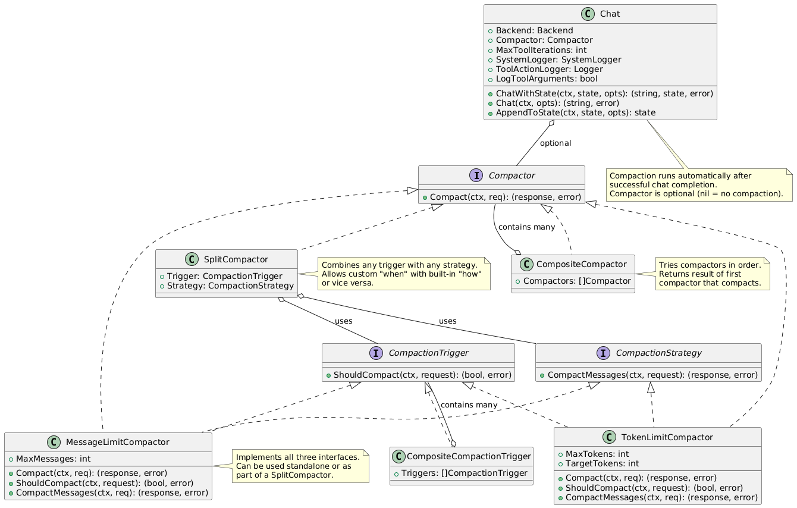

# Conversation State Management

This document explains how `goaitools` implements stateful multi-turn conversations.

**Status**: Implemented in version 0.3.0-beta.1 (feature/stateful-chats branch)

## Implementation Status

### ✅ Fully Implemented
- **Core state management**: `ChatWithState()`, `AppendToState()`
- **System message handling**: Leading system messages not persisted, mid-conversation messages preserved
- **State persistence**: Opaque `[]byte` with JSON encoding, versioning, provider-locking
- **Graceful degradation**: Invalid/corrupted/mismatched state silently discarded
- **Message limit compaction**: `MessageLimitCompactor` keeps last N messages
- **Token limit compaction**: `TokenLimitCompactor` uses actual API token usage
- **Composite strategies**: `CompositeCompactor`, `SplitCompactor` for flexible composition
- **Working examples**: `example/hellowithstate/`, `example/statecompaction/`
- **Comprehensive documentation**: This file, CLAUDE.md, specification.md

### 🔮 Future Enhancements (Deferred)
- **LLM-powered summarization**: Compactor that asks AI to summarize old messages
- **Tool exchange summarization**: Specialized handling for tool call sequences
- **TokenCounter interface**: Pluggable token counting (current implementation uses API token usage directly)

## Overview

The `ChatWithState()` API enables multi-turn conversations with state persistence, similar to OpenAI's session memory pattern. State is stored as an opaque `[]byte` that clients can persist between calls.

## Design Inspiration

This implementation follows the pattern described in OpenAI's [Conversation Context Management](https://platform.openai.com/docs/guides/conversation-context) documentation, with the following principles:

1. **System messages are not stored in session state** - they should be provided fresh on each call
2. **State contains only conversation history** (user/assistant/tool messages)

## System Message Handling

### Leading System Messages (Not Persisted)

Leading system messages (those at the start of the message list) are treated as "preamble" and are **NOT** stored in state:

```go
// First turn
response, state, _ := chat.ChatWithState(ctx, nil,
    WithSystemMessage("You are a helpful assistant...."),
    WithUserMessage("Hello"),
)
// API receives: [SystemMsg("You are a ...."), UserMsg("Hello"), AssistantMsg("..."), UserMsg("What's the weather?")]
// State contains: [UserMsg("Hello"), AssistantMsg("...")]

// Second turn - provide fresh system message
response, state, _ := chat.ChatWithState(ctx, state,
    WithSystemMessage("Possibly updated but likely the same system message"),
    WithUserMessage("What's the weather?"),
)
// API receives: [SystemMsg("Possible updated..."), UserMsg("Hello"), AssistantMsg("..."), UserMsg("What's the weather?")]
// State contains: [UserMsg("Hello"), AssistantMsg("..."), UserMsg("What's the weather?"), AssistantMsg("Warm and sunny")]
```

### Mid-Conversation System Messages (Persisted)

Methods are provided to add context to the persisted state without requiring a user action. In the game-bot example
this could be the user checking into a location. This allows the user to later ask "Tell me about this place...".

System messages that appear **after** the first non-system message are treated as contextual events and **ARE** preserved:

Claude tells me that I should be using user messages for this, and has implemented the UpdateStateAfterEvent method this
way. The API intends to preserve developer intent, so will preserve system messages inserted into message chain,
maintaining order if they appear after any user messages.

```go
// Using UpdateStateAfterEvent (convenience method)
state = chat.UpdateStateAfterEvent(ctx, state, "User has checked in at Harrogate Theatre")
// This adds a user message to state (contextual events use user role)

// Or manually via WithSystemMessage after other messages
chat.ChatWithState(ctx, state,
    WithUserMessage("First message"),
    WithSystemMessage("User completed task X"), // This WILL be stored
    WithUserMessage("Next question"),
)
```

## State Format

State is stored as JSON with the following structure:

```json
{
  "version": 1,
  "provider": "openai",
  "processed_length": 2,
  "messages": [
    {"role": "user", "content": "..."},
    {"role": "assistant", "content": "..."}
  ]
}
```

This is intended to be opaque to users of the API, and is subject to change.
The messages are raw messages received by the backend.

### Version Field

The `version` field allows detecting incompatible state format changes. Currently version 1.

### Provider Field

State is **provider-locked** - state created with OpenAI cannot be used with Anthropic. This prevents cross-provider compatibility issues.

### Processed Length Field

The system tracks the amount of messages seen by the LLM, excluding messages appended using `AppendToState()`. This is to allow a future
mechanism for pre-compaction should the amount of appended messages become large. From the TODO comment in code:

> TODO: Consider if we want to perform a compaction run if messages were added since the last LLM call.
This would be cheap and effective for a max message length compactor, but expensive and possibly unnecessary
for a summarising compactor. A better approach may to to offer a SummarisePendingMessages method so that the
caller can decide.

## Conversation History Compaction



As conversations grow longer, they consume more tokens and may eventually exceed API limits. The compaction system provides flexible strategies for managing conversation history size.

### Compaction Interface

The `Compactor` interface allows custom strategies for deciding when and how to compact:

```go
type Compactor interface {
    Compact(ctx context.Context, req *CompactionRequest) (*CompactionResponse, error)
}
```

Compaction occurs automatically after each successful chat completion (when finish reason is "stop"). The compactor receives:
- **StateMessages**: Current conversation history (excluding leading system messages)
- **LeadingSystemMessages**: The system preamble (for context, but not compacted)
- **LastAPIUsage**: Token usage from the most recent API call (if available)
- **Backend**: The backend being used (allows provider-specific strategies)

### Built-in Compactors

**MessageLimitCompactor** - Keeps only the last N messages:

```go
chat := &goaitools.Chat{
    Backend: client,
    Compactor: &goaitools.MessageLimitCompactor{
        MaxMessages: 20, // Keep last 20 messages
    },
}
```

**TokenLimitCompactor** - Removes messages when token count exceeds limit:

```go
chat := &goaitools.Chat{
    Backend: client,
    Compactor: &goaitools.TokenLimitCompactor{
        MaxTokens:    4000, // Trigger compaction above 4000 tokens
        TargetTokens: 3000, // Compact down to 3000 tokens (75% of max if not specified)
    },
}
```

### Composite Compaction Strategies

Use `CompositeCompactor` to try multiple strategies in order:

```go
chat := &goaitools.Chat{
    Backend: client,
    Compactor: &goaitools.CompositeCompactor{
        Compactors: []goaitools.Compactor{
            &goaitools.TokenLimitCompactor{MaxTokens: 8000},
            &goaitools.MessageLimitCompactor{MaxMessages: 50},
        },
    },
}
// Compacts if EITHER token limit OR message limit is exceeded
```

### Custom Compaction

For advanced use cases, separate the trigger (when) from the strategy (how):

* The `CompactionTrigger` interface specifies when to compact.
* The `CompactionStrategy` interface specifies how to compact.
* The `SplitCompactor` is a Compactor that combines a Trigger and a Strategy.

A Composite Pattern is provided for the `CompactionTrigger` interface to allow multiple triggers.

Both packaged Compactors implement the `CompactionTrigger` and `CompactionStrategy` interfaces, so can be used
in either place.

```go
// Custom trigger that compacts every 10 messages
type Every10MessagesTrigger struct{}

func (t *Every10MessagesTrigger) ShouldCompact(ctx context.Context, req *goaitools.CompactionRequest) (bool, error) {
    return len(req.StateMessages) >= 10, nil
}

// Use with any strategy
// This Compactor will truncate to 5 messages using the MessageLimitCompactor, but runs every 10 messages.
chat := &goaitools.Chat{
    Backend: client,
    Compactor: &goaitools.SplitCompactor{
        Trigger:  &Every10MessagesTrigger{},
        Strategy: &goaitools.MessageLimitCompactor{MaxMessages: 5},
    },
}
```

You can also implement the full `Compactor` interface for complete control (e.g., AI-powered summarization).

### Compaction Boundaries

Compaction should always occur at user message boundaries. The public method `AdvanceToFirstUserMessage()` is provided to support this.
This follows OpenAI's recommendation to maintain proper conversation structure. The two supplied Compactors follow this convention.

### When Compaction Occurs

- **After successful chat completion**: When `FinishReason` is "stop"
- **Before encoding state**: Compaction happens before state is serialized
- **Not during tool calls**: Compaction is skipped during multi-turn tool execution loops
- **Logged automatically**: Compaction events are logged via `SystemLogger` if configured

### No Compaction

If `Chat.Compactor` is `nil` (the default), no compaction occurs and conversation history grows unbounded. This is suitable for:
- Short conversations
- Applications with external state management
- When conversation length is controlled by application logic

## Forward Compatibility

The implementation uses an **opaque message design** to handle future provider API evolution:

### Message Interface

The Message interface allows the Chat tool calling loop and final response to work with opaque messages.

```go
type Message interface {
    Role() Role
    Content() string
    ToolCalls() []ToolCall
    ToolCallID() string
    MarshalJSON() ([]byte, error)  // Preserves ALL fields
}
```

Backends implement this interface and provide factory methods:

```go
type Backend interface {
    // ... existing methods ...

    NewSystemMessage(content string) Message
    NewUserMessage(content string) Message
    NewToolMessage(toolCallID, content string) Message
    UnmarshalMessage(data []byte) (Message, error)
}
```

## API Usage Patterns

See `example/hellowithstate/` for a complete working demonstration showing:
- Multi-turn conversations with `ChatWithState()`
- State persistence across turns
- Dynamic system messages (including timestamps)
- Using `AppendToState()` to add context without API calls
- System message behavior (not stored in state)

The examples folder contains sample code that also acts as integration tests for the system.

## Error Handling

State decoding is **gracefully degrading**:

- **Invalid JSON**: Discarded, starts fresh conversation
- **Unsupported version**: Discarded with log error
- **Provider mismatch**: Discarded (can't use OpenAI state with Anthropic)
- **Corrupted messages**: Discarded

This ensures users never get stuck with bad state - worst case is they lose conversation history.

## References

- OpenAI Conversation Context: https://platform.openai.com/docs/guides/conversation-context
